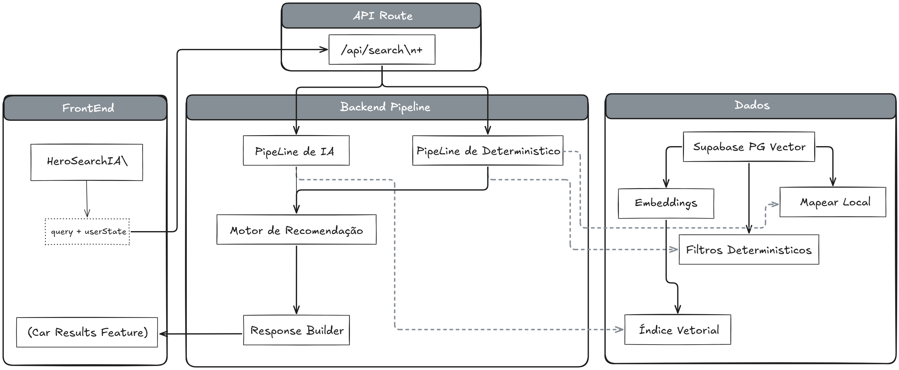

# Sumário Cargen

- [1. Escolhas Técnicas](#1-escolhas-técnicas)
  - [1.1 Cenários Identificados](#11-cenários-identificados)
  - [1.2 Fluxo Construído](#12-fluxo-construído)
  - [1.3 Estrutura de Pastas](#13-estrutura-de-pastas)
  - [1.4 Ferramentas e Stack](#14-ferramentas-e-stack)
- [2. User Experience](#2-user-experience)
  - [2.1 Funcionalidades mapeadas](#21-funcionalidades-mapeadas)
  - [2.2 Desenho da experiência do usuário](#22-desenho-da-experiência-do-usuário)
- [3. Plano de Negócios](#3-plano-de-negócios)
  - [Modelo de negócios](#modelo-de-negócios)
  - [Como eu atrairia os primeiros usuários](#como-eu-atrairia-os-primeiros-usuários)
  - [Estimativa de CAC](#estimativa-de-cac)
  - [Proposta de LTV e como eu maximizaria isso](#proposta-de-ltv-e-como-eu-maximizaria-isso)
  - [Monetização viável](#monetização-viável)
  - [Estratégias de retenção](#estratégias-de-retenção)
  - [Conclusão](#conclusão)

# Acesso:

**Versão online**

Acesse a plataforma clicando [aqui](https://cargen.vercel.app).

(O botão de Info no canto superior esquerdo tem algumas informações da estrutura da plataforma)

**Rodar localmente**

Pré-requisitos:

- **Node.js** (versão 18 ou superior)
- **npm** (ou outro gerenciador compatível)

Passos:

1. Clonar o repositório (ou baixar o código fonte).
2. Na pasta do projeto, instalar dependências:
   ```bash
   npm install
   ```
3. Configurar variáveis de ambiente no arquivo `.env`.
4. Subir o servidor de desenvolvimento:
   ```bash
   npm run dev
   ```
5. Acessar em `http://localhost:3000` no navegador.

# 1. Escolhas Técnicas

A arquitetura e o funcionamento geral do case foram pensados e estruturados com a ideia principal de separar claramente os fluxos de IA e as regras determinísticas do sistema, além de adotar uma abordagem baseada em embeddings e um pipeline um pouco mais estruturado e escalável para interpretar e avaliar as buscas.

A seguir, os principais pontos e decisões que levaram à construção desse fluxo, que busca manter a aplicação organizada e preparada para lidar com um catálogo maior de carros.

## 1.1 **Cenários Identificados**

Pontos que tentei atacar com a arquitetura da forma como ela está:

* Como fazer a avaliação de critérios subjetivos do prompt do usuário e devolver um resultado puxado por campos determinísticos;
* Como fazer a IA saber o que está no estoque sem simplesmente jogar o json no prompt;
* Como separar o que deve ser decidido por IA do que deve ser decidido por regras fixas do sistema;
* Como transformar a frase do usuário em um JSON estruturado, para que o backend consiga aplicar filtros sem depender de texto solto;
* Como fazer fallback inteligente, recomendando o carro mais próximo da intenção original em vez de simplesmente retornar vazio;
* Como fazer a IA conhecer semanticamente o estoque sem enviar todo o catálogo em cada prompt, usando embeddings e busca vetorial;
* Como tratar licalidade sem depender de IA, usando regras determinísticas separadas e um mapeamento simples de cidade para estado;
* Como estruturar a resposta da API para que ela sirva ao mesmo tempo para filtros do site, recomendação inteligente e pop-ups;

## 1.2 **Fluxo Construído**

<div align="center">
<sub>Fluxo em Alto Nível</sub><br>
<br>
</div>

**Explicação:**

Quando alguém escreve algo como "Queria comprar um BYD Dolphin por 80 mil", o sistema primeiro tenta transformar essa frase em algo mais estruturado que o restante do pipeline consiga entender melhor. Em vez de trabalhar diretamente com o texto livre, a ideia é identificar dentro da frase elementos como modelo, marca, orçamento aproximado e localização.

Essa etapa é feita pelo módulo **prompt-interpreter**. Ele recebe a frase do usuário e envia esse texto para a OpenAI API, que interpreta a intenção por trás do pedido. A partir disso, o sistema gera um JSON estruturado com campos fixos que representam essa intenção de forma organizada.

Esse passo é feita porque assim, o restante do sistema não precisa ficar interpretando linguagem natural o tempo todo. Depois que a frase vira esse objeto estruturado, o backend consegue aplicar filtros, buscar carros parecidos e organizar as recomendações de forma mais previsível.

Mas essa interpretação acontece considerando o contexto do catálogo que foi previamente indexado no Supabase utilizando **embeddings armazenados no Postgres com pgvector**. Esses embeddings representam semanticamente as descrições dos carros e ajudam o sistema a entender melhor o que o usuário quis dizer, mesmo quando a frase não é muito precisa.

No final dessa etapa, o sistema já tem uma representação estruturada da intenção do usuário. A partir daí entram o pipeline determinístico, a busca vetorial e o motor de recomendação que aparecem no restante do fluxo mostrado no diagrama.

**Possíveis Críticas:** 
- A arquitetura atual com certeza não era a forma mais simples de resolver a questão da busca de intenção e indicação de veículo correto, seria muito mais fácil passar o .json (Já que ele é pequeno) + o prompt/pergunta do usuário e devolver uma resposta estruturada chamando o card do carro por algum identificador, mas acredito que isso não apresentaria uma boa escalabilidade e funcionaria apenas para esse projeto de case, por isso escolhi fazer essa arquitetura, para colocar as ferramentas que realmente fariam sentido.
- Base de dados: O `data/cars.json` ainda é a Base de dados **principal**, o enriched foi usado apenas para gerar as embeddings e para alguns pequenos detalhes na página de visualização do carro.

**Pontos Atacados**
- Prompts subjetivos não vão quebrar o sistema, algo bem subjetivo ainda terá uma resposta satisfatória por conta dos embeddings a partir do .json enriquecido.
- Escala: Não ser um simples sistema que puxa o .json e lê ele inteiro para responder algo, torna o sistema muito mais escalável.

## 1.3 Estrutura de Pastas

```bash
.
├─ src
│  ├─ app
│  │  ├─ api
│  │  │  ├─ cars
│  │  │  └─ search
│  │  ├─ resultados
│  │  ├─ detalhe
│  │  ├─ simulacao
│  │  └─ como-funciona
│  ├─ components
│  │  ├─ blocks
│  │  ├─ features
│  │  └─ ui
│  ├─ backend
│  │  ├─ config
│  │  ├─ data
│  │  ├─ db
│  │  └─ modules
│  ├─ lib
│  └─ config
├─ public
│  └─ img
│     ├─ logo
│     └─ ...
├─ img
│  └─ arq.png
├─ README.md
└─ ...
```

## 1.4 Ferramentas e Stack

- **Frontend**: Next.js 15, React, TypeScript e Tailwind CSS.
- **Design / UI**: Opus 4.6 e Pencil para criação dos componentes e layout das páginas.
- **Backend**: Rotas `app/api` do Next.js, módulos próprios em `src/backend` para orquestrar fluxo de IA, filtros determinísticos, scoring e response builder.
- **Banco de Dados**: Supabase (Postgres) com extensão **pgvector** para armazenar embeddings e fazer busca vetorial.
- **Infra de IA**: OpenAI API (prompt interpreter, embeddings, recomendação híbrida).
- **Dados**: Catálogo base em `data/cars.json` e versão enriquecida em `cars-enriched.json` para geração de embeddings e melhoria de contexto sem inflar o prompt.

## 2. User Experience

### 2.1 Funcionalidades

- **Página inicial (`/`) – Busca com IA**
  - Campo de busca em linguagem natural com opção de usar IA ou modo simples.
  - Seleção opcional de estado do usuário para personalizar resultados por localização.
  - Gatilho de busca que redireciona para `/resultados` com os parâmetros (`q`, `state`, `mode`).
  - Faixa de marcas (`BrandsRow`) permitindo filtrar rapidamente por marca, levando para `/resultados?brand=...`.
  - Grade de cards de carros em destaque (`CarGrid`) com CTA para ver todos os carros.

- **Resultados da busca (`/resultados`)**
  - Interpretação da busca com IA (`searchCarsWithAI`) quando em modo IA, incluindo:
    - resumo textual da IA sobre o que ela entendeu da intenção do usuário;
    - lista de carros ordenada por relevância, com selo de **“Recomendado pela IA”**;
    - destaque de **oferta especial** com selo e call-to-action para simular condições.
  - Modo por marca, quando a navegação vem de `/resultados?brand=...`, exibindo apenas carros daquela marca.
  - Filtros laterais (`FiltersPanel`):
    - faixa de preço com slider (priceRange);
    - tipo de carro;
    - botão de limpar filtros.
  - Contador de resultados e indicação de critério de ordenação (relevância da IA, filtro por marca ou preço).
  - Estados de apoio ao usuário:
    - loading amigável enquanto a IA processa a busca;
    - mensagem de vazio quando nenhum carro passa nos filtros.
  - Pop-ups contextuais:
    - aviso de preço acima do orçamento;
    - aviso de distância quando o carro recomendado está longe, sugerindo opção mais próxima;
    - pop-up de condições especiais, explicando como o carro pode caber no bolso via financiamento/consórcio e levando à página de simulação.
  - Cards de resultado com:
    - imagem do carro, ano, quilometragem, câmbio, combustível;
    - preço e localização;
    - selo de recomendação/condições especiais quando aplicável;
    - CTA para **“Ver detalhes”** ou **“Ver condições”**.

- **Detalhe do carro (`/detalhe`)**
  - Navegação de volta para a lista de resultados (`BackNav`).
  - Destaque de recomendação pela IA.
  - Galeria de imagens do carro com foto principal e miniaturas clicáveis.
  - Box de preço à vista com CTA para consultar financiamento.
  - Botões para:
    - **Comprar**;
    - **Simular financiamento**;
    - **Simular consórcio** (abrindo o `FinanceModal`).
  - Indicação de loja e localização do carro.
  - Bloco de “Detalhes do veículo” com informações técnicas (ano, quilometragem, câmbio, combustível etc.).
  - Bloco “O que a IA considerou”, explicando, em linguagem simples, por que aquele carro foi classificado como boa combinação para o uso do usuário.

- **Simulação de pagamento (`/simulacao`)**
  - Resumo do carro selecionado (dados básicos e preço).
  - Abas de **Financiamento** e **Consórcio**, com estilos diferentes para indicar qual está ativa.
  - Formulário de simulação:
    - valor de entrada;
    - prazo em meses;
    - renda mensal aproximada;
    - percentual máximo da renda comprometida.
  - Cálculo automático da parcela mensal, entrada, prazo e checagem se a parcela fica ou não dentro do limite de renda.
  - Feedback visual positivo/negativo sobre a saúde da simulação (parcela dentro ou fora de um limite saudável).
  - Card de explicação sobre futura integração com instituições financeiras (APIs reais de bancos/financeiras).
  - CTA **“Avançar para falar com a loja”**, fechando a jornada com geração de contato/lead.

- **Página “Como funciona” (`/como-funciona`)**
  - Explicação em linguagem acessível do pipeline de IA e regras determinísticas.
  - Cards explicando cada etapa do fluxo:
    - interpretação da frase do usuário;
    - filtros determinísticos;
    - busca vetorial semântica;
    - scoring híbrido IA + regras;
    - geração de recomendações, pop-ups e avisos;
    - construção da resposta final exibida na interface.
  - Destaque visual para a diferença entre o “pipe determinístico” e o “pipe inteligente”, reforçando que a IA complementa, e não substitui, as regras de negócio.

### 2.2 Desenho da experiência do usuário

Do ponto de vista do usuário final, a experiência foi desenhada como um fluxo consultivo simples, em que a pessoa começa na **página inicial** descrevendo sua necessidade em linguagem natural, escolhe (se quiser) o estado e dispara a busca. A **tela de resultados** devolve não só uma lista de carros, mas também contexto da IA (resumo da intenção, destaque de melhor oferta, avisos de preço e distância) e filtros claros, permitindo que o usuário refine a pesquisa sem se perder. Os **pop-ups contextuais** entram como uma camada de orientação comercial: quando o carro está acima do orçamento, eles sugerem caminhos financeiros (financiamento/consórcio) para viabilizar a compra; quando o carro recomendado está distante, ajudam a redirecionar para uma opção em localização mais próxima, sem quebrar a intenção original da busca. Quando um carro chama atenção, a pessoa entra na **página de detalhe**, onde entende melhor o veículo, vê por que a IA o recomendou e é convidada a avançar para simulações de pagamento. Na **simulação**, a jornada muda de “qual carro faz sentido para mim?” para “como esse carro cabe no meu bolso?”, com feedback imediato sobre a viabilidade financeira e um passo final para falar com a loja. Paralelamente, a página **“Como funciona”** existe para dar transparência técnica ao processo, mostrando que há um equilíbrio entre IA e regras determinísticas, o que ajuda a gerar confiança em quem está avaliando tanto o produto quanto a solução de negócio.

## 3. Plano de Negócios

### **Modelo de negócios**
Se eu fosse lançar esta solução no mercado, eu não venderia primeiro para o consumidor final como um app isolado. Eu venderia para lojas, revendas e grupos de concessionárias como uma camada de inteligência  comercial para o estoque que eles já tem e impulsionamento de vendas.

A proposta seria relativamente simples. Em vez de o cliente navegar vários filtros e abandonar o site quando não encontra exatamente o que quer, como é a experiência em sites como OLX e em menor grau no WebMotors, ele poderia escrever algo como “quero um carro confortável até 80 mil” ou “quero um Corolla, mas que caiba no meu bolso”, e o sistema transformaria isso em recomendação, alternativas e oportunidades de vender produtos financeiros.

O modelo mais viável seria SaaS B2B, com cobrança mensal por loja ou grupo de lojas, com planos baseados em volume de estoque, número de buscas e recursos avançados. Em um estágio mais maduro, eu adicionaria também cobrança por performance, por exemplo por lead qualificado gerado ou por agendamento iniciado.

A solução também seria ótima para concessionárias que estão em um dos dois cenários: fim de mês e é necessário bater a meta de vendas da montadora, ou lançamento de veículo com potencial, em que a loja geralmente não tem estoque e as filas de espera aumentam muito.

O produto venderia mais conversão de estoque, mais leads qualificados e menos perda de cliente por essa fricção na busca. Os sites atuais para isso, não o fazem muito bem, e no caso do OLX por exemplo, nem é o maior foco deles, o site ainda depende de anúncios para sobreviver, anúncios esses que geram ainda mais fricção na navegação e busca.

### **Como eu atrairia os primeiros usuários**
Eu começaria por um nicho bem específico, porque tentar atacar “o mercado automotivo inteiro” logo de início seria caro e pouco eficiente. Meu foco inicial seriam revendas independentes e lojas multimarcas com operação digital fraca ou média, concessionária/lojas de bairro, que normalmente têm site básico, tráfego e estoque, mas pouca ou nenhuma inteligência de busca e recomendação.

A estratégia inicial seria um tanto prática, eu tentaria abordar as primeiras lojas mostrando uma demonstração com o próprio estoque delas, porque esse tipo de produto fica muito mais convincente quando o proprietário ou controlador daquela loja vê o produto dele nesse tipo de ferramenta, e a princípio o custo para ele poderia ser baixíssimo, eu precisaria cobrar dessa primeiras lojas apenas o necessário para manter a plataforma no ar, ainda não faria sentido tentar fazer dinheiro nessa etapa.

Os canais iniciais seriam:

- prospecção direta via OLX, WhatsApp comercial e PRINCIPALMENTE Instagram (Uma loja pequena pode não ter um site, mas uma página no instagram sempre tem)
- contato com empresas que vendem CRM, DMS ou sites automotivos para revendas
- oferta piloto gratuita ou barata para os primeiros parceiros (O suficiente para manter a plataforma de pé)

Meu objetivo não seria volume no início. Seria conseguir 5 a 10 operações para validar se a busca aumenta clique em anúncio, tempo na sessão, lead e agendamento.

A parte mais difícil disso seria criar uma base mínima de usuários, de início seria interessante tentar utilizar os canais que já existem dessas concessionárias/lojas pequenas, por exemplo: oferecer para uma dessas lojas que tem presença digital num nível OK o serviço de forma gratuita e em troca eles deveriam divulgar a plataforma em seus canais oficiais proativamente, precisaria disso apenas para o pontapé inicial.

### **Estimativa de CAC**
No início, meu CAC seria relativamente baixo se eu focasse em venda consultiva enxuta e distribuição por parceria. Eu estimaria algo entre R$ 300 e R$ 1.500 por loja, dependendo do canal.

Se a aquisição vier por prospecção direta com demonstração e fechamento rápido, o CAC pode ficar mais perto da faixa inferior. Se envolver tráfego pago, ciclo comercial mais longo e customização maior, ele sobe.

Para um MVP comercial, eu partiria com a hipótese de:

- CAC inicial médio de R$ 700 por loja
- com meta de reduzir isso ao longo do tempo por indicação, prova social e canais parceiros

Esse valor é aceitável se o ticket mensal for saudável e se a retenção for boa.

### **Proposta de LTV e como eu maximizaria isso**
O LTV que vejo sendo o mais interessante aqui não vem de transformar o produto em uma ferramenta de Business do processo comercial da loja.

Algo como:

- plano mensal entre R$ 199 e R$ 799 para lojas pequenas e médias
- contrato médio de pelo menos 12 meses
- LTV estimado entre R$ 2.400 e R$ 8.000+ por cliente, dependendo do plano e permanência

Para maximizar esse LTV, eu tentaria não deixar o produto virar apenas mais uma das alternativas no site. Ele precisaria se conectar ao que importa para a loja (para lojas médias isso faz mais sentido, lojas pequenas costumam ser um pouco imaturas nessa parte), como:

- captura de lead
- agendamento de visita
- intenção de financiamento
- recomendação de carros parados no estoque
- métricas de busca mais feita e demanda não atendida

Quanto mais ele entrar na operação comercial e gerar dado útil, mais difícil fica removê-lo.

Um outro fenômeno que ocorre com, especificamente, concessionárias no Brasil é o de que carros ficam mais baratos no final do mês ou ano. Isso é real, e ocorre por conta de metas de vendas impostas pelas montadoras à essas concessionárias, inclusive em algumas ocorre o fenômeno de vendedores comprarem um ou dois carros para bater a meta da concessionária e depois vendê-los mais barato.

Uma forma de capitalizar nessa situação, que é recorrente para concessionárias, e aumentar o LTV seria durante esse período em que a loja é nossa cliente, dar destaque para os produtos dela que estão nessa categoria de “Preciso vender para bater a meta”, e evitar que o vendedor tenha o trabalho de comprar e revender um carro da própria concessionária. 

### **Monetização viável**
A monetização mais viável seria uma combinação de três camadas.

A primeira seria assinatura mensal SaaS, que seria a base do negócio.

A segunda seria camada de taxas:

- taxas que variam de acordo com a venda;
- taxas baixas e fixas em certos modelos;
- taxas mais elevadas para carros que precisam ser vendidos para atingir a meta, impulsionamos mais o carro e cobramos uma taxa maior, e mesmo assim para loja valerá mais a pena isso do que não bater a meta ou comprar o carro e revender.

A terceira, no futuro, seria monetização por serviços transacionais e parceiros, como:

- lead qualificado enviado para financiamento;
- integração com consórcio;
- parceria com instituições financeiras.

Isso cria um negócio com receita recorrente, ainda que baixa, no começo e possibilidade de monetização de maior margem depois.

### **Estratégias de retenção**
A estratégia de retenção aqui depende de provar valor comercial continuamente, seja por vendas, leads ou ajuda a atingir a meta.

As principais estratégias de retenção seriam:

- mostrar painel com métricas claras de impacto, como buscas realizadas, cliques em carros, leads iniciados e conversões assistidas;
- destacar quais carros são muito buscados;
- mostrar quando a IA ajudou a recuperar uma busca que resultaria em abandono;
- permitir campanhas comerciais usando a própria lógica do recomendador, por exemplo empurrar estoque parado com condições especiais para finalizar metas;
- revisar mensalmente com a loja o desempenho do sistema, como um produto de growth embedded.

Em paralelo, eu criar elementos simples de retenção no lado do usuário final, como:

- histórico recente de buscas
- favoritos
- alertas de novas opções parecidas
- recomendações mais personalizadas ao longo do tempo
- foco na venda de produtos financeiros, que deixam o usuário atrelado a plataforma de alguma maneira.

Assim o produto tenta reter os dois lados, tanto a loja quanto o comprador. De início precisamos agradar as lojas com taxas baixas ou nulas, o suficiente para manter a plataforma, e depois que tivermos um GMV minimamente agradável podemos progressivamente empurrar mais os produtos financeiros e retirar os “subsídios” nas taxas.

### **Conclusão**
Eu vejo esse produto menos como um “buscador com IA” e mais como um vendedor digital consultivo embutido no estoque da loja. O diferencial não é só entender texto natural. O diferencial seria tornar uma busca vaga ou inviável em uma conversa comercial útil, e permitindo que linguagem natural seja coletado é ainda mais fácil traçar o perfil dos usuários.

Se bem executado, ele pode aumentar a taxa de aproveitamento do tráfego que a loja já tem, reduzir abandono na navegação do estoque e criar oportunidades de venda mesmo quando o carro pedido não está exatamente disponível nas condições ideais.

Além disso, é uma boa oportunidade para capitalizar com a pressa das concessionárias em períodos de final de ano e mês se ainda estão longe da meta.


